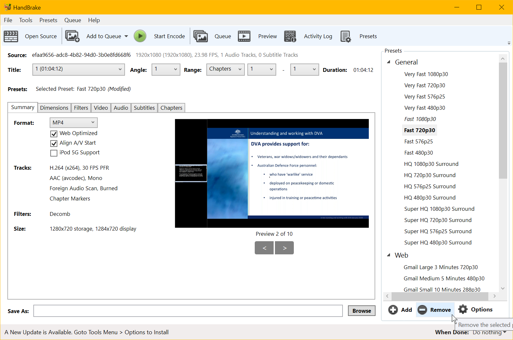

This folder contains information about HandBrake.  You will find a preset file and a pdf of the directions for manually configuring HandBrake.

HandBrake

## HandBrake Encoding Settings

### Introduction:

Included in this folder is a HandBrake preset that you can import.

To import the preset, choose Preset > Import from file. The preset will be called Mediasite Preset 1.

### Summary tab

Format: MP4.
Preset: Fast 720p30.
Web Optimized: Selected.
Align A/V start: Selected.

### Dimensions tab

1280 x 720 or less depending on the source material.

### Filters tab
Skip unless you need to perform on of those operations on your video.

### Video tab

Video Codec H.264.
Framerate set to your frame rate of your material. Either use the "Same as Source" settings or set the FPS here. The FPS setting should be not more than 30 fps.
Constant frame rate selected.
Avg bitrate 1500 or less. Depending on the content and your goals the bitrate could be lessened.
2 pass encoding.
Turbo first pass.

Encoder preset
Use whatever preset your conformable with.  The slower the better things will look.

Encoder level
Auto.

In Extra Options enter
Use "keyint=#".
Replace the # symbol with your value. For the value get the frames per second value and multiply it by 2 for a key frame every 2 seconds.  Multiply by 4 for a key frame every 4 seconds.  The keyframe frequency has be be less than one every 6 seconds to bypass transcoding.

### Tune tab
For screencast I sometimes try "Still Image".  The quality is a little better with that tuning.  Its not that significant however.
	

### Audio tab
Set the bitrate and the mixdown mode (stereo or mono).

### Subtitle tab
Skip.

### Chapters tab
Skip.

